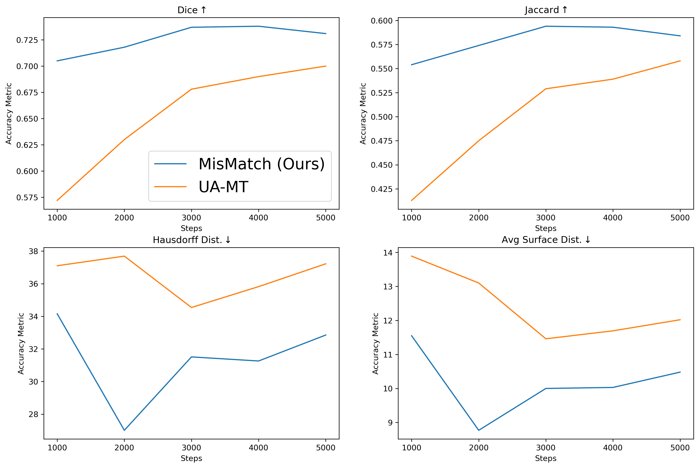

### News
[2022 Sep 15th] For easier maintenance (also as requested by the reviewers of the journal version of our paper), we release a new version of our implementation based on the data and the code from a previous well-known paper '[Uncertainty-aware Self-ensembling Model for Semi-supervised 3D Left Atrium Segmentation](https://arxiv.org/abs/1907.07034)' which was written by [Lequan Yu](https://yulequan.github.io/)

[2022 Oct 28th] We released a new extended version of MisMatch on arxiv: https://arxiv.org/pdf/2110.12179.pdf

### Introduction
This repository is an implementation of our MIDL 2022 Oral paper '[Learning Morphological Operations for Calibrated Semi-Supervised Segmentation](https://openreview.net/pdf?id=OL6tAasXCmi)' on a public available dataset which was not included in the original MIDL paper. This code base was written and maintained by [Moucheng Xu](https://moucheng2017.github.io/)

### Hyper-Parameters
| LR   | Batch | Seed | Width | Consistency | Labels | Steps | 
|------|-------|------|-------|-------------|--------|-------|
| 0.01 | 4     | 1337 | 8     |       1     |      2 |  5000 |


### Results
| Models (5000 steps) | Dice (⬆) | Jaccard (⬆) | Hausdorff Dist. (⬇) | Average Surface Dist. (⬇) |
|:-------------------:|----------|-------------|---------------------|---------------------------|
|        UA-MT        | 0.73     | 0.58        | 32                  | 10                        | 
|   MisMatch (Ours)   | 0.70     | 0.55        | 37                  | 12                        | 





### Installation and Usage

This repository is based on PyTorch 1.4. To use this code, please first clone the repo and install the anaconda environments via:

   ```shell

   git clone https://github.com/moucheng2017/Morphological_Feature_Perturbation_SSL

   cd MisMatchSSL

   conda env create -f midl.yml

   ```

To train the baseline, use:

   ```shell

   cd MisMatchSSL/code

   python train_LA_meanteacher_certainty_unlabel.py --gpu 0 --batch_size 4 --seed 1337 --width 8 --consistency 1.0 --labels 2 --steps 5000

   ```


To train our proposed model MisMatch, use:

   ```shell

   cd MisMatchSSL/code

   python train_LA_meanteacher_certainty_unlabel.py --gpu 0 --batch_size 4 --seed 1337 --width 8 --consistency 1.0 --labels 2 --steps 5000

   ```

### Citation

If you find our paper or code useful for your research, please consider citing:

    @inproceedings{xu2022midl,

         title={Learning Morphological Operations in Calibrated Semi-Supervised Segmentation},

         author={Xu, Moucheng and Zhou, Yukun and Jin, Chen and deGroot, Marius and Wilson Frederick J. and Blumberg, Stefano B. and Alexander, Daniel C. and Oxtoby, Neil P. and Jacob, Joseph},

         booktitle = {International Conference on Medical Imaging with Deep Learning (MIDL)},

         year = {2022} }


If you use the LA segmentation data, please also consider citing:

      @article{xiong2020global,

         title={A Global Benchmark of Algorithms for Segmenting Late Gadolinium-Enhanced Cardiac Magnetic Resonance Imaging},

         author={Xiong, Zhaohan and Xia, Qing and Hu, Zhiqiang and Huang, Ning and Vesal, Sulaiman and Ravikumar, Nishant and Maier, Andreas and Li, Caizi and Tong, Qianqian and Si, Weixin and others},

         journal={Medical Image Analysis},

         year={2020} }

### Note for data
The left atrium dataset We provided the processed h5 data in the `data` folder. You can refer the code in `code/dataloaders/la_heart_processing.py` to process your own data.


### Questions
Please contact 'xumoucheng28@gmail.com'


### Ackwnoledgement
Massive thanks to my amazing colleagues at UCL and GSK including Yukun Zhou, Jin Chen, Marius de Groot, Fred Wilson, Neil Oxtoby, Danny Alexander and Joe Jacob.
